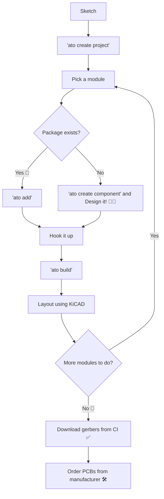

See the [installation guide](./guides/install) for advanced setups.
For the simple way to get started, read on.

import QuickstartInstall from "/snippets/atopile/guides/quick-install.mdx";

<QuickstartInstall />

## Trying out an example

Press `Ctrl+Shift+P` and search for `atopile: Open Example`.


Choose any example you like from the selection.
After confirming wait for the `ato menu bar` to appear:


Press on the play button to compile the example.
You will be greeted by the logs in the terminal:


If you have KiCAD installed, you can now press on the PCB icon in the ato menu bar to open the layout file.

## A typical workflow

1. Sketch your circuit on paper.
2. Search https://packages.atopile.io and GitHub for pre-existing modules you need, and use `ato add` to install them.
3. Design a module and do its calculations using `ato` code.
4. Run `ato build` to compile your project, choose components to suit your design, and update your layout (PCB) file.
5. Use KiCAD to lay out any changes
6. Repeat steps 3-5 until you're happy with your design.
7. When you're done with your design, push your changes to your repo.
8. CI will automatically build and test your project, and generate the manufacturing files you need to order your PCBs.
9. Take these manufacturing files to your PCB manufacturer to get your PCBAs.



## Creating a project

```sh
ato create project
```

And follow the prompts to create a new project from the template.

## Project Structure

Your new project will have a file structure like this:

```
.
├── LICENSE                    # 1. Default MIT license. You are free to change this
├── README.md                  # 2. A description of your project
├── ato.yaml                   # 3. atopile's configuration file
├── build                      # 4. Build artifacts and cache (not version controlled)
├── layouts                    # 5. KiCAD layout files
│   └── default                # 6. There's a directory / layout per "build target"
│       └── default.kicad_pcb  # 7. The layout file that will be updated every time you run `ato build -b default`
└── demo.ato                   # 8. Your atopile source file
```

The most important three files in there are:

- `demo.ato` - your atopile source file - this is where you write your atopile code
- `default.kicad_pcb` - the layout file - this is the "board" file that looks like a PCB, and you can order from
- `ato.yaml` - atopile's configuration file - this file is how atopile knows this is a project and what to do when you run `ato build`

## Hello, World!

Here's a simple example of atopile code:

import QuickstartExample from "/snippets/atopile/examples/ch1_0_quickstart.mdx";

<QuickstartExample />

Update `demo.ato` (of whatever you've named your source file) with this code.

To build it, run:

```sh
ato build --open
```

You should see a flurry of activity in the terminal with this message towards the end

```sh
INFO     Build successful! 🚀
```

Then KiCAD will open up (that's what the `--open` flag does).
Your shiny ✨ new component should be waiting for you in the top left corner (possibly off the current screen).


Oh yeah! We're in business. 😎

## What's next?

This isn't even a circuit yet, merely a single component however you now:

- Have the `ato` CLI and compiler set up and working
- Know how to add components to your design
- Have KiCAD installed and working

In the [tutorial](./essentials/1-the-ato-language) we continue with a real circuit, installing and using packages, maths and version control.
