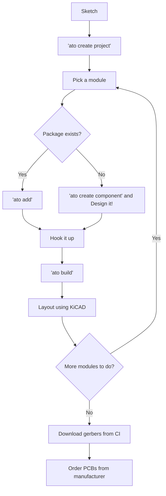

A well-organised folder structure makes it easy to navigate, build and publish atopile projects. This page walks through the **recommended structure** for both everyday projects and reusable packages.

## 1. High–level layout

```text
<project_name>/
 ├─ .ato/               # Cached dependencies
 ├─ build/              # Build outputs
 ├─ ato.yaml          # Project manifest (paths, builds, dependencies)
 ├─ elec/               # Electrical files and layouts
 ├── layouts/           # Board layout files
 ├── src/               # Core ato code and parts
 ├─── <project_name>.ato  # Main project file
 ├─── parts/            # Part info (pinout, footprint, 3d model)
```

* **ato.yaml**–the central manifest read by the compiler and package manager.
* **src/**–pure ato source; keep one module per file where possible.
* **layout/**–KiCad footprints, STEP models or manual board tweaks.

## 2. The `ato.yaml` manifest

The manifest glues everything together. A minimal example:

```yaml
requires-atopile: "^0.10.8"

paths:
  src: ./src
  layout: ./layout

builds:
  default:            # The target you usually build
    entry: main.ato:App
    hide_designators: true
    exclude_checks: ["PCB.requires_drc_check"]

dependencies:         # Added automatically by `ato add`
  - type: registry
    identifier: atopile/ti-ads1115
    release: 0.1.6
```

* **paths**–lets you move `src/` or `layout/` somewhere else if needed.
* **builds**–define one or more build targets (for example: default, panelized, test-jig).
* **dependencies**–registry, git or local packages installed with `ato add`.

## 3. A typical workflow

1. Sketch your circuit on paper.
2. Search https://packages.atopile.io and GitHub for pre-existing modules you need, and use `ato add` to install them.
3. Design a module and do its calculations using `ato` code.
4. Run `ato build` to compile your project, choose components to suit your design, and update your layout (PCB) file.
5. Use KiCAD to lay out any changes
6. Repeat steps 3-5 until you're happy with your design.
7. When you're done with your design, push your changes to your repo.
8. CI will automatically build and test your project, and generate the manufacturing files you need to order your PCBs.
9. Take these manufacturing files to your PCB manufacturer to get your PCBAs.

