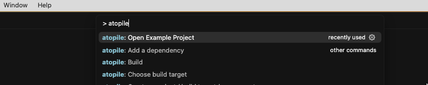

## Trying out an example

Press `Ctrl+Shift+P` and search for `atopile: Open Example`.

Choose any example you like from the selection.
After confirming wait for the `ato menu bar` to appear:

Press on the play button to compile the example.
You will be greeted by the logs in the terminal:

If you have KiCAD installed, you can now press on the PCB icon in the ato menu bar to open the layout file.

## What's next?

In the [Essentials tutorial](../essentials/1-the-ato-language) we continue with a real circuit, installing and using packages, maths and version control.
