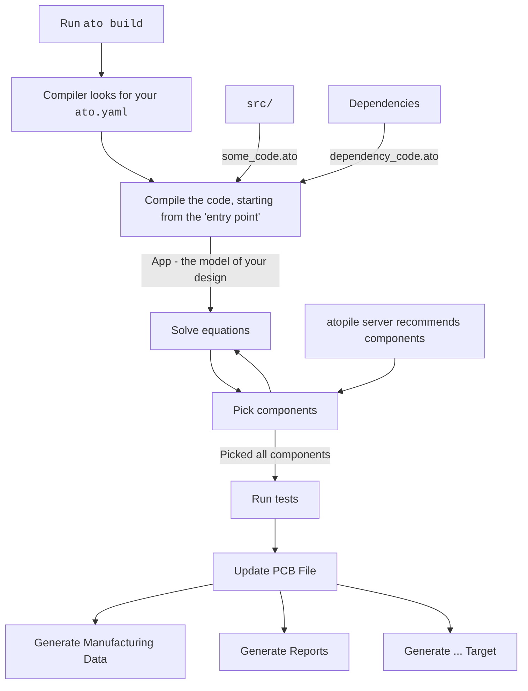

The `ato` command line interface is the main way to interact with atopile.

The command-line tool has tools to:

- Build your code to update your PCB
- Test your design
- Generate files to order your PCBs from manufacturers
- Install and manage dependencies
- Create new projects, components or build-targets

There's a semi-de-facto standard format for running apps from the terminal, including `ato`.

```sh
app command [options] arguments
```

1. `app` is the name of the app you're running.
2. `command` is the command; think of it as a "menu option" the app provides.
3. `options` are the options for the command, typically zero to many instances of `--some-option option-value`.
4. `arguments` are just like options, but they only take a value. Their position tells the app which argument they are.

<Tip>
    Add `--help` to the app/command/subcommand to get more information at any point.
</Tip>


## Command structure
Some commands might have subcommands. Think of it like a menu where, from left to right you're choosing deeper and deeper into the menu.

If an upper command/app accepts options, those options should go right after the app/command, rather than at the end after subcommands.

For example, `-v` is a special option, called a "flag," which doesn't take a value. Its presence or absence is what matters. It increases the amount of information the compiler prints -> increase its verbosity.

The `-v` flag is an app option, so to use it, place it right after the app name.

```sh
ato -v build
    ```

## Build process

As a rough overview, here's what happens when you run `ato build`:



## Explaining the hello-world project

<Note>
    This tutorial continues from the [quickstart](../quickstart.md) guide.

    If you haven't already, complete it, and then come back here.
</Note>
With the explanation of `ato` code and the [build process](#build-process), it should be a little more clear what's happening now in the [quickstart](../quickstart.md) project.


import Ch1_0_Quickstart from '/snippets/examples/ch1_0_quickstart.mdx';

<Ch1_0_Quickstart />


Here's a breakdown:


1. Import a `Resistor`
2. Define a new `module`, named `App`.
    This is the [**entry point**](../reference/config.md#builds.entry) of the build (see your `ato.yaml`).
3. Create an instance of the `Resistor`
4. Set the resistor's `value` attribute
    This constrains what components the compiler can pick for this resistor.
    For picking, the rated resistance must be wholly within the `value` attribute. The precise way to say this in more CS terms / what atopile says internally is that the picked resistor's resistance must be a subset of the quantity interval defined by the value attribute.

## Extending it

Suppose the circuit needs a simple voltage divider - and the standard library doesn't exist containing one pre-made and tested for you.

It's easy to create your own!

import Ch1_1_BadVoltageDivider from '/snippets/examples/ch1_1_bad_voltage_divider.mdx';

<Ch1_1_BadVoltageDivider />

Now, this is, technically, a voltage divider. And the compiler happily builds it, grabbing the right components etc.

But, it's not a good voltage divider.

- There's no clear interface showing how to connect to it
- The point of a voltage divider is to scale voltage, but it's unclear what its scaling actually is
- No documentation describes what's going on

To fix that:

import Ch1_2_GoodVoltageDivider from '/snippets/examples/ch1_2_good_voltage_divider.mdx';

<Ch1_2_GoodVoltageDivider />

Much better! This is a better approach.

Here's a breakdown:

1. When possible, import from the standard library.
2. Define a new `module`, named `VoltageDivider`
    This means you can trivially have as many `VoltageDivider`s as you want, all configured properly with all the same interfaces.
3. Document with `"""`
4. Place external interfaces somewhere obvious
    Use sensible types, like `Power` to expose them.
5. Embed the relationships between parameters with `assert`
    Read these statements as "make sure the following is true."
    1. The output voltage is within the range of the voltage divider ratio equation
    2. The input voltage must be greater than the output voltage
    3. The current through the bottom resistor must be within the allowed range of the maximum quiescent current
