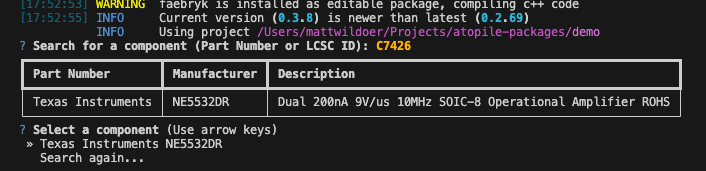

## 1) Auto pick passive components

The simplest way to add components is to let atopile pick them for you. This works for passive components such as 
[resistors](/atopile/api-reference/components/resistor), [capacitors](/atopile/api-reference/components/capacitor), and [inductors](/atopile/api-reference/components/inductor).

For example, let's say you need a 10kΩ resistor with 1% tolerance in an 0402 package:
```ato
resistor = new Resistor
resistor.resistance = 10kohm +/- 5%
resistor.package = "0402"
```
When you build your project, atopile will automatically select a resistor that meets your requirements from the JLCPCB parts library.

## 2) Add specific component

The embedded `ato create part` CLI tool fetches a part and adds the pinout, footprint, and 3D model to your project.

```bash
ato create part
```

You'll be prompted for a search term for a component. This may be:

 - A JLCPCB part number (for example `C7426`)
 - An **exact** manufacturer part number (for example `NE5532DR`)

Enter `C7426` and press enter.

<Frame caption="ato create component search">
  
</Frame>

Go ahead and tap `Enter` through the default options.

## The new `component`

```ato
#pragma experiment("TRAITS")
import has_datasheet_defined
import has_designator_prefix
import has_part_picked
import is_atomic_part
import is_auto_generated

component Texas_Instruments_NE5532DR_package:
    """Dual Low-Noise High-Speed Audio Operational Amplifier, 10 to 30 V, 0 to 70 degC, 8-pin SOIC (D8), Green (RoHS  no SbBr)"""

    # This trait marks this file as auto-generated
    # If you want to manually change it, remove the trait
    trait is_auto_generated<system="ato_part", source="easyeda:C7426", date="2025-07-21T19:08:39.725091+00:00", checksum="9ceb07e67aa12682752248762e4ff9ff1de1992976dd6441f44ace4f4bce1f96">

    trait is_atomic_part<manufacturer="Texas Instruments", partnumber="NE5532DR", footprint="SOIC-8_L4.9-W3.9-P1.27-LS6.0-BL.kicad_mod", symbol="NE5532DR.kicad_sym", model="SOIC-8_L4.9-W3.9-H1.7-LS6.0-P1.27.step">
    trait has_part_picked::by_supplier<supplier_id="lcsc", supplier_partno="C7426", manufacturer="Texas Instruments", partno="NE5532DR">
    trait has_designator_prefix<prefix="U">
    trait has_datasheet_defined<datasheet="https://lcsc.com/datasheet/lcsc_datasheet_2410122011_TI-NE5532DR_C7426.pdf">

    # pins
    signal IN1neg ~ pin 2
    signal IN1pos ~ pin 3
    signal IN2neg ~ pin 6
    signal IN2pos ~ pin 5
    signal OUT1 ~ pin 1
    signal OUT2 ~ pin 7
    signal VCC_GND ~ pin 4
    signal VCCpos ~ pin 8

```

Let's break it down.

The `component` keyword tells the compiler that a new component class is being specified, which is a subclass of `module`.

The `has_part_picked` trait tells the compiler it can pick that JLCPCB part to fill this spot.
The `manufacturer` and `mpn` attributes together fully specify which component this is as well.
If you're making a component class for a specific component, it's typically a good idea to include at least either the `lcsc_id` or the `mpn` + `manufacturer`.

The `is_atomic_part` trait tells the compiler that this component represents a physical part that can be placed on a PCB. The trait takes several important attributes including the manufacturer and partnumber (MPN) of the part, along with the KiCad footprint and symbol files and 3D model (STEP) file to use for rendering the part.


The `datasheet_url` and `designator_prefix` attributes are optional, but it's a good idea to include them. They're self-explanatory.

### `pin`

Use the `pin` keyword to define electrical interfaces, which the compiler maps to pads on the footprint.

That is, `pin 2` says:

- Create a signal named `2` (the compiler treats pins as a special-case where they may have an integer name)
- Connect the signal to pad "2" on the footprint

## 3) Use a package from the registry

The [atopile package registry](https://packages.atopile.io) contains many pre-made [packages](./4-packages) for common components. For example, if you need an RP2040 microcontroller, you can install the package:

```bash
ato add atopile/rp2040
```
## 4) Create custom part

For parts not available through `ato create part`, you can manually add components to your parts directory.

1) Create a new folder to your parts directory `project/parts/` named the same as your component.
2) Add existing KiCad footprint and 3D model to parts directory, or use KiCad's footprint editor to create a new footprint.
3) Create a .ato file in this folder with the same name as your component.

## Good practice

Here are a few recommended tweaks to your component class:

### Abstract classes

When you're creating a class representing a specific component, for which there's a generic abstract class (for example, an `LDO`), import and subclass that abstract class to get its generic methods and attributes.

For example, you should update the component class like this:

```ato
component Texas_Instruments_NE5532DR from LDO:
```

Then, connect its pins to the LDO's signals, set known attributes etc...

### Take the `mpn` and `manufacturer` from `ato create component`

`mpn` and `manufacturer` are only interpreted properly if they exactly match a component in the database.
