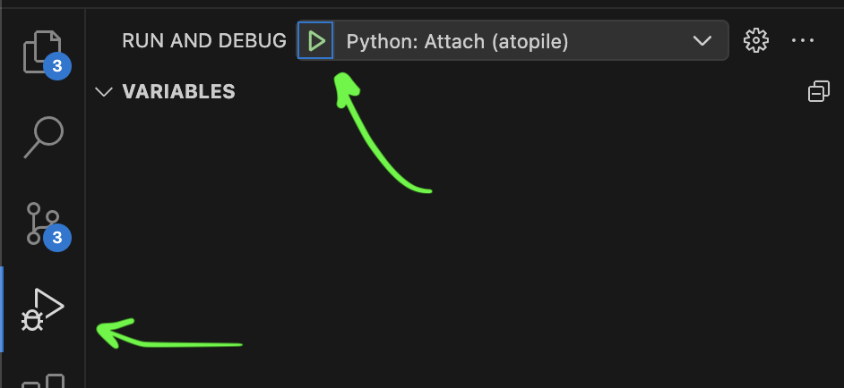

## Prerequisites

- [Editable atopile install](./install#editable-installation-best-for-development)

## Dev tools

VSCode is recommended for development. If nothing else, it has heaps of high quality extensions and atopile language support, plus it's used internally - making it easier to configure for purpose.

You should have at a minimum:
- [Cursor](https://www.cursor.com/) or [VSCode](https://code.visualstudio.com)
- [Cursor / VSCode atopile extension](https://marketplace.visualstudio.com/items?itemName=atopile.atopile) (also works for Cursor)

### Verbosity

You can increase the verbosity of atopile by using the `-v`, `-vv` or `-vvv` flags, for example `ato -vv build`

<Tip title="Flag Location">
  Flags are placed after the `ato` command and before the command you want to run. For example, `ato -vv build` runs the build command with the verbose flag set to the highest level, while `ato build -vv` will not work.
</Tip>

### Debugging

You can start the command-line tool in debug mode by using the `--debug` flag, for example `ato --debug build`

This runs a [`debugpy`](https://github.com/microsoft/debugpy) server on port `5678` which you can connect to with the VSCode built-in debugger.

<Frame caption="Connect debugger in VSCode">
  
</Frame>

<Tip title="Syntax highlighting isn't working">
  If you're having trouble with syntax highlighting in the debugger, it might be because VSCode sets up a mapping between the remote and local file paths by default—remove it.
</Tip>
