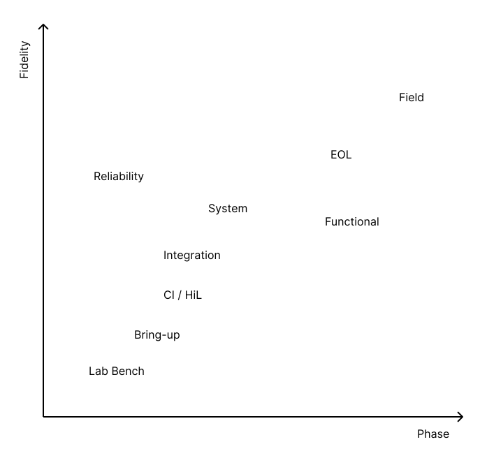
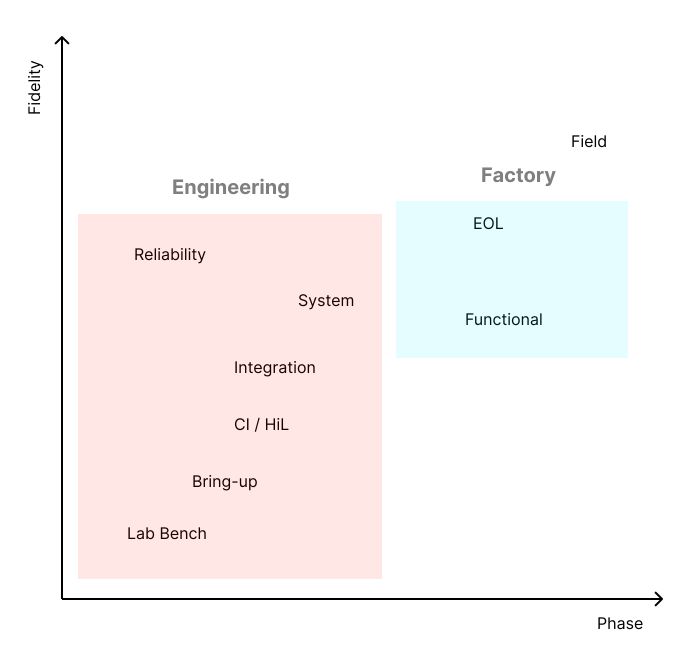
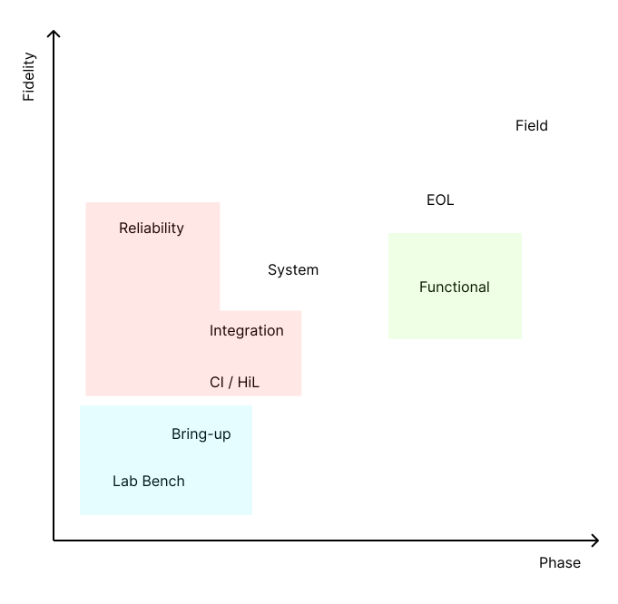

If your team touches hardware, you're going to need to test it. Whether it's for design validation, system integration, or factory QA, the right tools make development scalable to design enormously complex products quickly and reliably. The wrong ones slow your team down, delay launches and degrade your customer's confidence.

Consider whether to:

- one-shot vs. automate runs
- orchestrate vs. setup ad-hoc
- log results vs. read them out
- have shared setups to log into vs. dedicated per-user or per-test setups
- capture statistical vs. pass-fail results
- spot-check values vs. sweep for coverage
- test all-up vs. mock out parts of the system

Additionally, there are a bunch of reasons you want to test like design verification, integration, reliability, quality assurance, certification, etc...

We make it easy to have the best testing tools for your project.

---

## 📊 Map and Glossary

{/* <!-- From https://www.figma.com/design/Qn1D3rrxEvVmCYNGyyVf3Z/Test-Phases?node-id=0-1&p=f&t=VL8JLH9yD1DsdA9i-0 --> */}

As your project progresses, your test requirements resolve and confidence in the design increases. Testing expectations increase alongside it. In order to consider what to test and what equipment is best suited for the job, it can be useful to map it out in lifecycle and figure out whether shortcuts can be taken. Often it's useful to reduce fidelity and mock out parts of the board or system to save time, money and test corner-cases that are otherwise unreachable.

🧠 A mental model for hardware testing:

- **Phase** of the project lifecycle. It's not strictly linear or chronological, but for a typical project you start with bring-up on a lab bench, design verification, move through integration with the rest of the system, and then into manufacturing test before finally field testing.
- **Fidelity** of the test is a measure of how closely the test matches the real world. One of the biggest factors here is how much of the system is connected together and how much you're emulating or mocking.

Here, they're plotted with some common test categories. Think of this as a map or mood board, rather than a prescriptive guide.

### Common Ownership

To add some color, here's who's often responsible for these tests:

### Equipment Split

You can think of the **lab** (blue, bottom-left) as tools like your multimeter - they typically have a readout, are setup ad-hoc and are dedicated to a user or lab. This means it's helpful for them to be relatively cheap, portable and easy to configure.

The **shared** (red, top-left) are tools like a server rack filled with testers for specific functions and shared amongst a team. These tools are typically much more stable, automated, orchestrated as when to run. Integration testing also frequently will combine multiple racks of these to emulate a substantial part of a system.

One often-overlooked distinction between these two categories, and a misstep in combining them, is availability. If you need to run CI, it's extremely costly to have someone borrow the equipment for an ad-hoc setup.

The **factory** (green, right) is equipment optimised to provide a self-contained, automated, but dedicated and manually triggered setup for factory testing.

### Glossary and Key Terms

#### Bring-up (a.k.a. bench testing)

Early phases and low fidelity. This is the first time you get a board and you want to check it out.

Picture a lab bench with multimeters, scopes, bench-top power supplies and everything is bespoke. You're connecting to the board via probes and harnesses. Typically done by the design engineers who created the board. Some results are logged as evidence of design verification, but particularly early much is based on spot-checked, one-shot tests conducted in a dedicated ad-hoc setup.

#### Reliability

Phase typically just after bring-up, but with higher fidelity - ensuring the exercise of the board is more representative of the real world.

Technically also broadly under "design verification", but typically done in a more bespoke environment, like a thermal chamber or vibration table. These setups are more often than not also highly bespoke, but run for longer periods and are therefore more costly, meaning their results are logged as explicit evidence of design verification. This testing might include some abuse such as thermal cycling, vibration or salt spray.

#### Design Verification

When referred to alone, engineers are usually talking about functional verification in a lab environment.

More broadly, this is the process of ensuring the design meets the requirements provided.

For teams that repeatedly build very similar products, there's often a lot of value in investing in automation here.

#### Continuous Integration

A process for automated software and firmware on every commit / change made, typically before it's even merged into the main branch.

When you think of CI, picture the green tick ✅ (or red cross ❌) on a GitHub PR.

Typically started during the early engineering phases of the project, but continued through the rest of the project's life, with fidelity varying. Considered critical infrastructure for every modern software team.

#### Hardware-in-the-Loop (a.k.a. "HiL")

When said alone, this refers to automated, typically CI-based testing with at least some section of hardware involved in the test loop.

The hardware might be as small as a single device or microcontroller where the rest of the system is emulated by a FPGA (low fidelity) or as large as a whole instrumented system (high fidelity).

When you think of HiL testing, picture a server rack with each shelf hosting a board from your product or DUT (device under test), and a tester that manipulates and measures signals from the DUT.

Typically, HiL testing:

- is done with a system that's shared between many engineers
- is orchestrated via GitHub and a test runner, like `pytest`
- stores results for verification and auditing
- provides broad coverage, routinely running hundreds of tests for every commit
- must be very reliable and fast, since it's run so frequently and its results should be used to gate features merging

#### Integration

A phase of testing after bring-up with increasing fidelity as each component is added to the system.

When said alone, it typically refers to bringing a few components together but not yet a full system.

You might also hear the term "buck" thrown around here often in the automotive industry, which refers to a partially complete system for running tests on.

#### System

After the integration phase, this is when a whole system is complete and tested together as a unit. This is typically pretty high-fidelity testing, though sometimes elements are mocked out for cost, safety or to save time during testing (cells in a battery pack).

When you think of system testing, picture a fully assembled product, but instrumented up with additional equipment to exercise it.

#### Functional

When referred to alone, this is typically a test of an assembled board before it's assembled into a product or larger system. Usually at a mid-fidelity skipping past some of the circuits on the board and injecting signals at test points. This happens at the manufacturing phase in the factory the board was assembled.

Picture the board in a bed-of-nails fixture, full of pogo pins in a factory.

Functional testing more broadly refers to the process of verifying a board or system meets its requirements.

#### End of Line (EOL)

At the end of the manufacturing test phase when a system or subsystem is complete, it's tested one last time with everything brought together to shake it down and ensure all the connections were made correctly.

Picture an assembled product, plugged into a test station at the end of the manufacturing line. It looks finished and ready to ship, because physically it is (🤞 - after passing it's tests).

There's some fuzziness in the language here, so it's often interchanged with functional testing and vice versa. We're taking it as everything above an assembled PCBA, because functional test is already wildly overloaded.