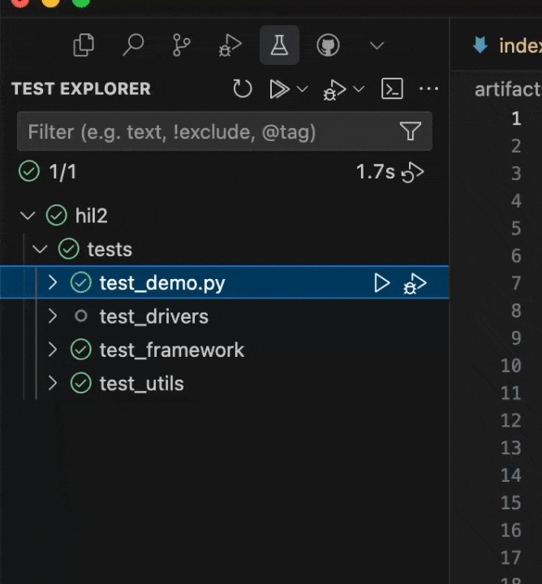

- Trivially commission new setups
- Queue tests, so you can share with colleagues
- Securely sync your test code to the right hardware
- Collect and deliver results back to you

Just press play and we'll take care of everything else.

<video autoPlay loop muted playsinline>
    <source src="./images/run-test-vscode.mp4" type="video/mp4" />
    
</video>

<Warning>This feature is in closed alpha. If you'd like to try it out, please [get in touch](mailto:hi@atopile.io).</Warning>

## How it works

<Steps>
  <Step title="Bundle your test">
    We bundle up, zip and shoot up your test code to the server.
  </Step>
  <Step title="Queue for hardware">
    We wait for a machine that fits your needs, or a specific machine if you want, and send it down.
  </Step>
  <Step title="Run">
    We execute your tests in a dedicated clean environment, and collect the results.
  </Step>
  <Step title="Done">
    We'll send the results back to you, and clean up after ourselves.
  </Step>
</Steps>
