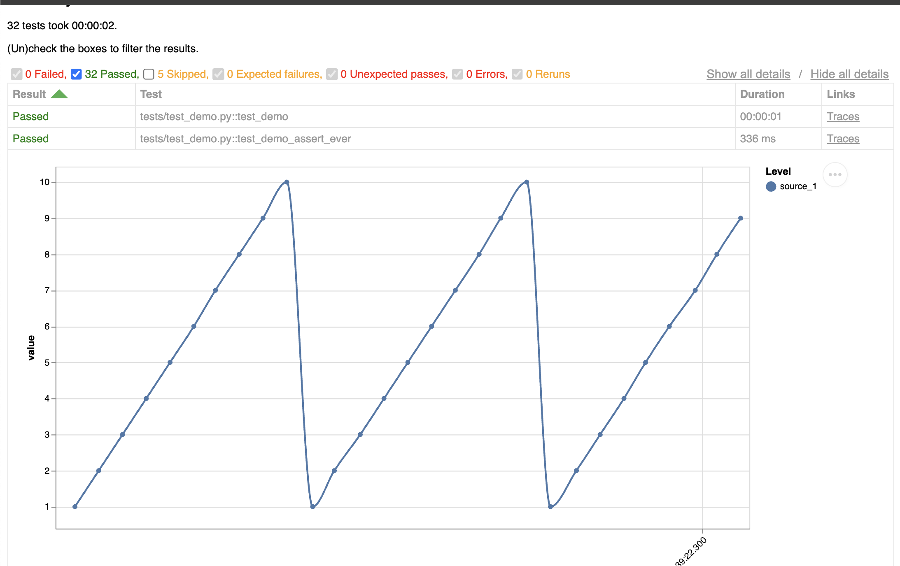

Start scripting tests in Python and produce (beautiful) reports in minutes.

```python
@pytest.mark.runs_on(hostname="chunky-otter")
async def test_performance(hil: "Hil"):
    async with hil:
        for cell in hil.cellsim.cells:
            await cell.reset()
            await cell.set_voltage(1)
```

Running tests will also automatically generate an [interactive report](/assets/hil/test-report/test-report.html) which includes interactive plots of the measured data.


