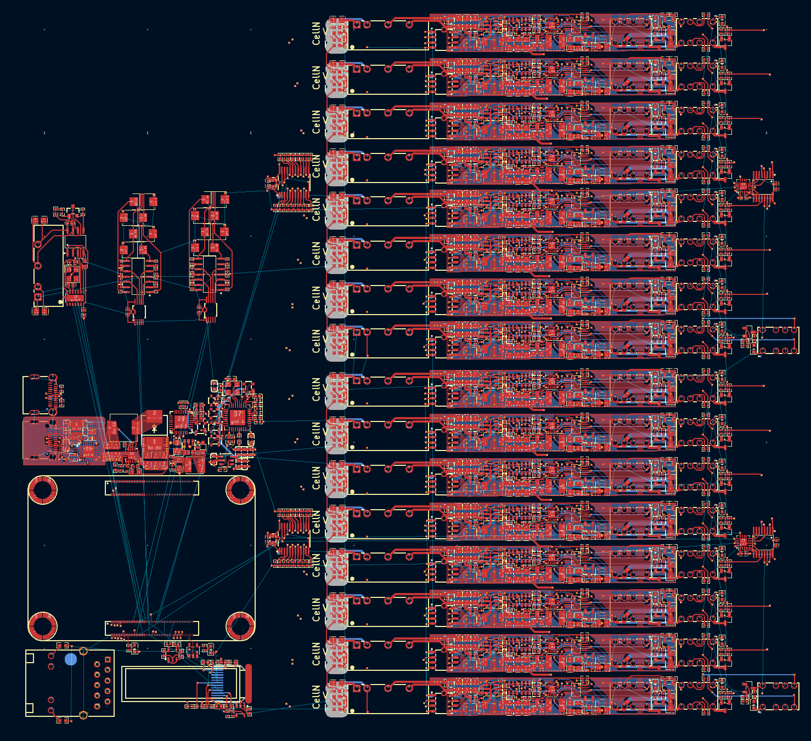
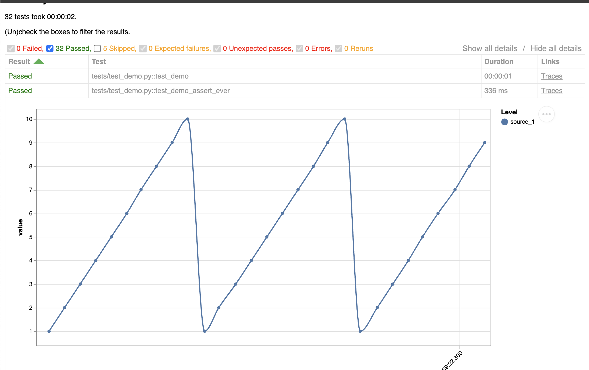

<CardGroup cols={2}>
    <Card title="Hardware" icon="bolt">
        Sense, sniff, control, communicate, measure and more. We've got you covered.
    </Card>
    <Card title="Drivers" icon="code">
        Drivers come out of the box. Make talking to your hardware easy.
    </Card>
    <Card title="Framework" icon="cubes">
        Tools atop pytest let you script up your tests in python in minutes.
    </Card>
    <Card title="Distribution (alpha)" icon="paper-plane">
        Remotely run tests on any hardware from anywhere.
    </Card>
</CardGroup>

### Hardware Blocks 🧱

Make it trivial to exercise, measure and communicate with electronics hardware.

Take for example this 16ch cell simulator. Using these blocks it's only 134 lines of [`atopile`](https://atopile.io) code.




### Test Framework 🧪

This suite includes a test framework making it near trivial to start scripting tests in python and produce (beautiful) reports - based on top of `pytest`.

```python
@pytest.mark.runs_on(hostname="chunky-otter")
async def test_performance(hil: "Hil"):
    async with hil:
        for cell in hil.cellsim.cells:
            await cell.reset()
            await cell.set_voltage(1)
```

Running tests will also automatically generate an [interactive report](/assets/hil/test-report/test-report.html) which includes interactive plots of the measured data.


