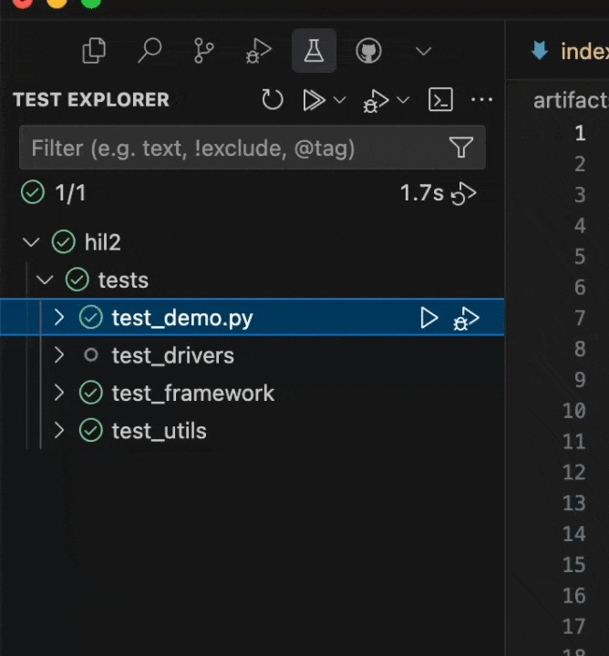

## Features ✨

### Hardware Blocks 🧱

Make it trivial to exercise, measure and communicate with electronics hardware.

Take for example this 16ch cell simulator. Using these blocks it's only 134 lines of [`atopile`](https://atopile.io) code.


### Test Framework 🧪

This suite includes a test framework making it near trivial to start scripting tests in python and produce (beautiful) reports - based on top of `pytest`.

```python
@pytest.mark.runs_on(hostname="chunky-otter")
async def test_performance(hil: "Hil"):
    async with hil:
        for cell in hil.cellsim.cells:
            await cell.reset()
            await cell.set_voltage(1)
```

Running tests will also automatically generate an [interactive report](/assets/hil/test-report/test-report.html) which includes interactive plots of the measured data.


### Test Distribution 🚀

Managing HiL setups is typically a pain. Instead, simply mark your tests with the requirements of the hardware they need to run on, and invoke them normally - the orchestration will automatically send it to an appropriate setup to run it for you with the click of a button

```python
@pytest.mark.runs_on(hostname="chunky-otter")
```

<video autoplay loop muted playsinline>
    <source src="./images/run-test-vscode.mp4" type="video/mp4" />
    
</video>
